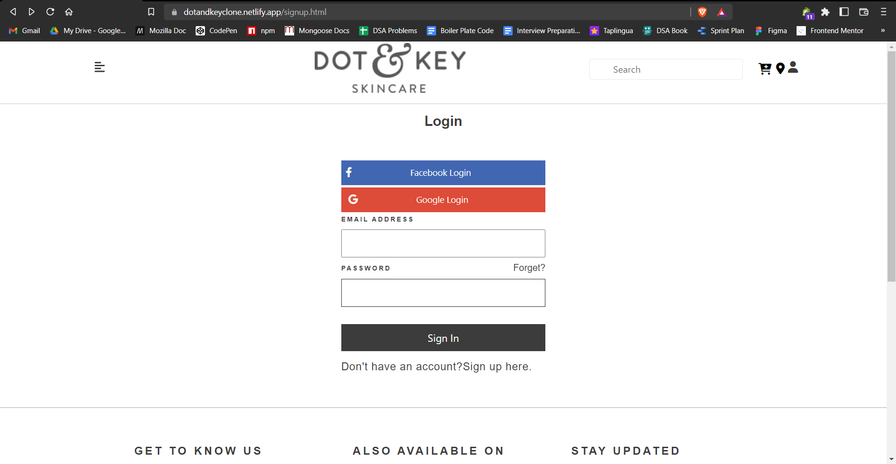
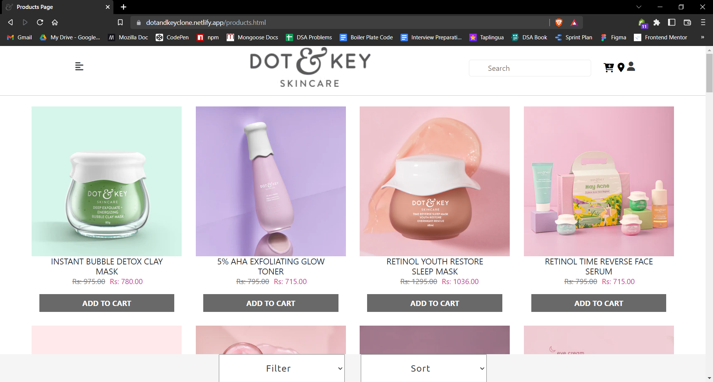

## Dot & Key Clone
Hello everyone, we are a group of 6 members cloned a website 'Dot & Key' in our construct week at Masai School.
Look out our website:- https://dotandkeyclone.netlify.app/

## Features

- Sort & filter by many options on product page.
- Get a smooth experience in payment, login & signup process.
- Manual and automatic carousels.
- Offcanvas on cart page.
- Animations on carousels.

## Screenshots

### 1. Home Page

### 2. Login Page

### 3. Signup Page

### 4. Products Page

### 5. Product View Page

### 6. Cart Modal

### 6. Checkout Page

## Tech Stack

In this project we used following tech stacks:- 
- [HTML](https://developer.mozilla.org/en-US/docs/Web/HTML)
- [CSS](https://developer.mozilla.org/en-US/docs/Web/CSS)
- [JS](https://developer.mozilla.org/en-US/docs/Web/JavaScript)
- [Bootstrap](https://getbootstrap.com/docs/5.2/getting-started/introduction/)
- [Webscrap](https://webscraper.io/)
- [Slick Slider](https://kenwheeler.github.io/slick/)
- [Jquery](https://jquery.com/)

## Connect with authors

- [Harshal Pardeshi](https://www.linkedin.com/in/harshalpardeshi/) => Backend of website,
- [Udit Varshney](https://www.linkedin.com/in/udit-varshney-ba678121b/) => Login, Signup, Navbar & Footer Pages,
- [Swapnil Gote]() => Homepage,
- [Gaurav Mishra](https://www.linkedin.com/in/gaurav-mishra-435814a8) => All Carousels in website,
- [Rohit Mourya](https://www.linkedin.com/in/rohit-mourya/) => Product Page,
- [Mohammad Momin](https://www.linkedin.com/in/momin-mohammad-102304171/) => Cart & Checkout Pages.

## Feedback

If you have any feedback or queries, please reach out to us at pardeshiharshal90@gmail.com.

